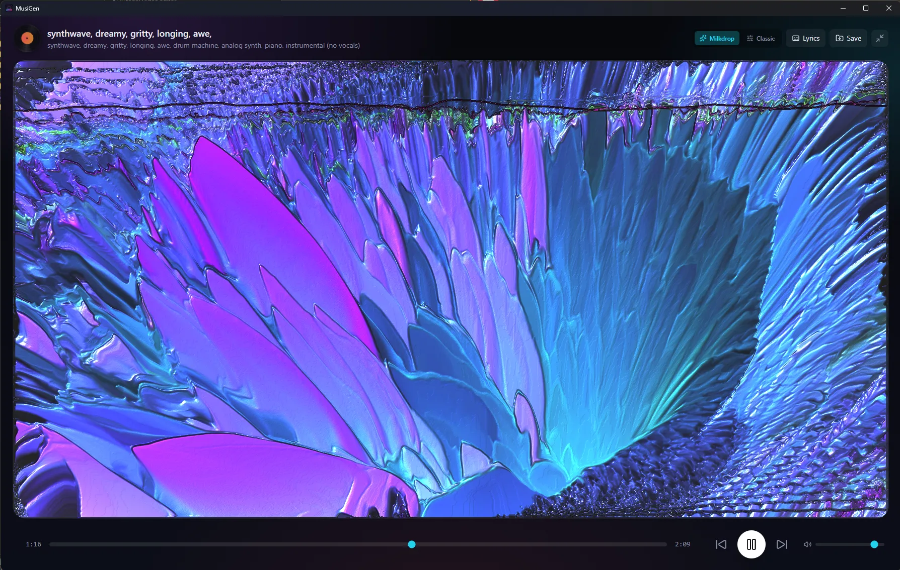
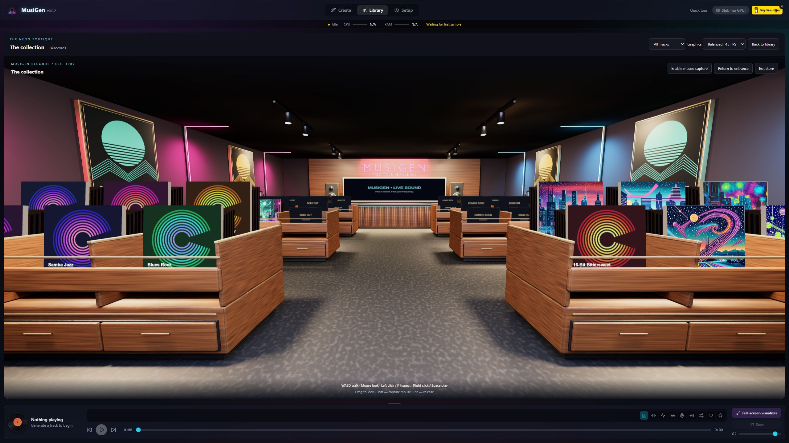
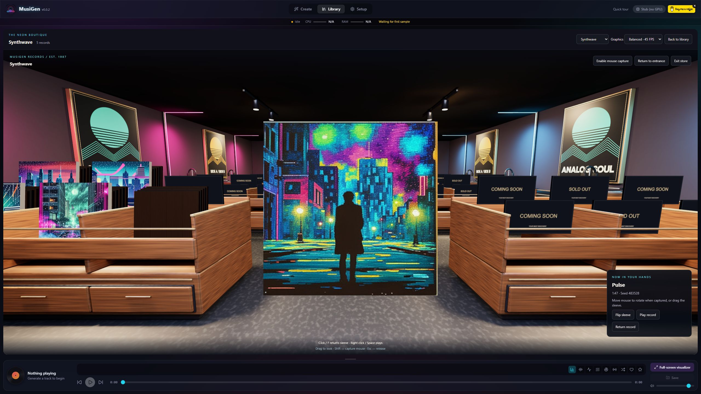
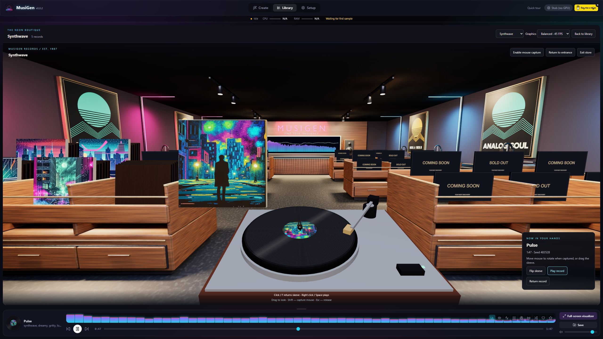
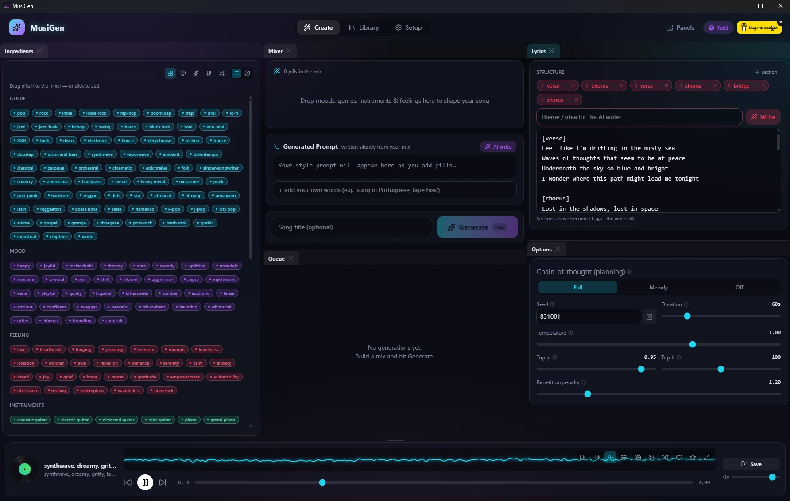
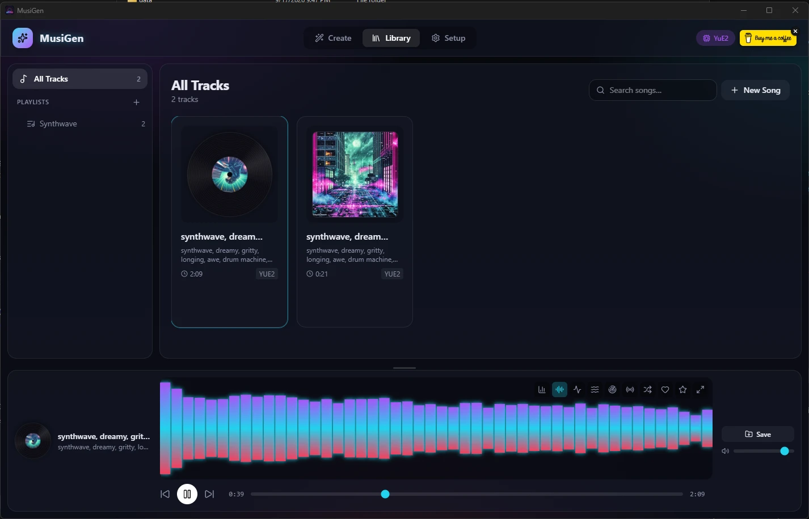
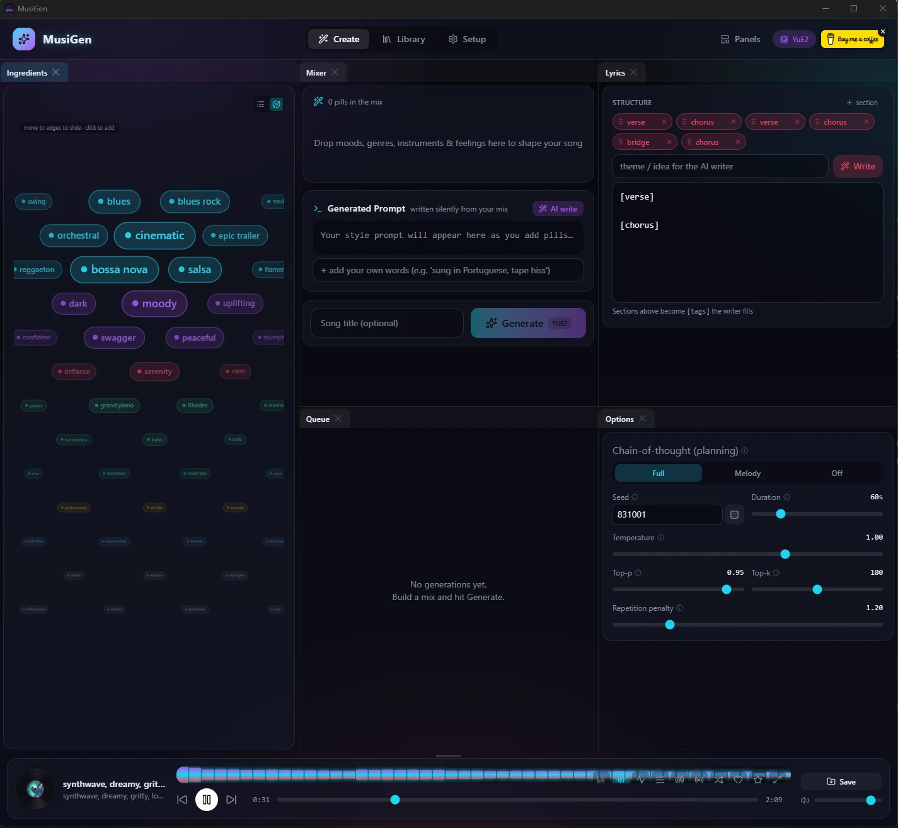
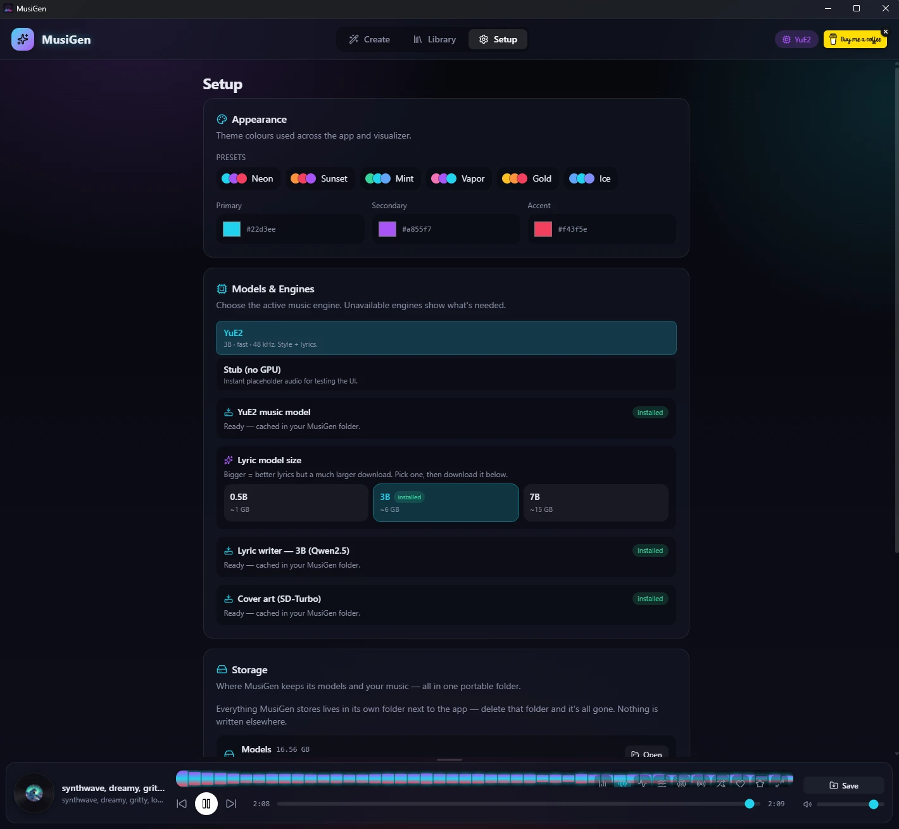

<div align="center">


# MusiGen

**A beautiful, fully‑local, all‑in‑one AI music studio for Windows.**

Generate complete songs — music *and* lyrics — on your own GPU, with a Napster/Winamp‑era player, striking Milkdrop visualizers, AI cover art, and a drag‑and‑drop "mixer". No cloud. No accounts. No telemetry. Everything lives in one portable folder.

[](LICENSE)
[](#-getting-started-portable-app)
[](#-how-it-works)
[](../../releases/latest)
[](https://buymeacoffee.com/criso2hdj)



</div>

---

## New in v0.0.2

**Step inside your music collection.** The Neon Boutique is a first-person, 1980s-inspired record shop built into MusiGen. Walk between walnut crates, pick up an album, inspect its artwork, and play it on an animated turntable—all without leaving the app.



- **An interactive vinyl shop:** WASD navigation, Shift mouse capture, rotating sleeves, a sliding turntable, spinning records and a moving tonearm. Neon stays lit as the room lights brighten on entry and dim on exit. The back-wall screen responds to your music.
- **Bring your own melody:** import audio or MIDI, record a hum with your microphone, or capture a connected MIDI keyboard with audible monitoring. Optional media tools can be installed or repaired from Setup. Reference arrangements guide generation; they do not guarantee an exact cover or final duration.
- **A more useful Mixer:** searchable ingredients, adjustable text size, customizable pills, Pair suggestions and Shake up. Reference controls sit above Generate, with a collapsible queue beneath it and a permanent system-resource strip at the top.
- **Better song recipes:** saved seeds and generation settings, automatic titles when left blank, recipe restoration and remixing. Lyrics can be written for the selected duration, with warnings when they may not fit.
- **Library and playback improvements:** compact and expanded cards, song details, clearer playlist controls, and playback that stays within the selected playlist.
- **Clearer visualizers and lyrics:** an explicit full-screen button, remembered/pinned presets, auto-cycle off by default, lyric appearance controls and optional word-timing synchronization. Recognized timing may need correction; unsynchronized scrolling is approximate.

The store opens while heavy AI work is idle and releases its graphics resources when generation needs the GPU. Choose Balanced or Low graphics in the store. See [store controls and asset details](docs/STORE_3D.md).

| Inspect the sleeve | Play the vinyl |
| :---: | :---: |
|  |  |

These are actual app screenshots at **2560 × 1440**; click an image to view it at full resolution. The source on `main` includes v0.0.2; check the [release tag](../../releases) before downloading a packaged build.

## ✨ Highlights

- 🎵 **Real music generation** — powered by **[YuE2](https://github.com/multimodal-art-projection/YuE)** (3B), running **standalone** (no ComfyUI), 48 kHz stereo, style + lyrics aware.
- ✍️ **AI lyric writer** — a local **Qwen2.5** model writes structured `[verse]/[chorus]/[bridge]` lyrics and silently composes the generation prompt from your mix. Pick the size that fits your disk (0.5B / 3B / 7B).
- 🧪 **The Mixer** — drag & drop **"pills"** (genres, moods, feelings, instruments, pacing…) into the mixer; the AI gathers them into a rich style prompt. A magnifying **orbit view** makes browsing 250+ tags fun.
- 🌈 **Winamp‑nostalgia visualizers** — a full **Milkdrop** engine (via [Butterchurn](https://github.com/jberg/butterchurn)) with **367 presets**, auto‑cycle, a pinnable default, and a per‑preset enable/disable rotation — plus lightweight built‑in skins. Drag the player past ⅓ of the screen and it fades into Milkdrop automatically.
- 🖼️ **AI cover art** — a local **SD‑Turbo** model paints an album cover from each song's title + lyrics + style. When you press play, the flat cover fades into a spinning vinyl whose label *is* the artwork.
- 📀 **Library & playlists** — organise tracks, rename, remix (loads a song's whole recipe back into the mixer with a fresh seed), and save with **lyrics + cover art embedded** into the FLAC.
- 🎧 **Smooth playback** — songs cross‑fade in and out; a persistent bottom player follows you across every tab.
- 📦 **Truly portable** — ships as a ZIP. Extract, run, and it installs its runtime and downloads only the models you choose, all **inside its own folder**. Delete the folder and it's gone — nothing touches AppData or the registry, nothing runs in the background.

## 🔊 Hear a sample

A 45‑second clip generated by YuE2 inside MusiGen (synthwave · dreamy · gritty):

▶️ **[docs/media/sample-synthwave.flac](docs/media/sample-synthwave.flac)**

## 📸 Screenshots

| Create — the Mixer | Library — with AI covers |
| :---: | :---: |
|  |  |

| Orbit pill browser | Setup — models & storage |
| :---: | :---: |
|  |  |

## 🚀 Getting started (portable app)

1. Download the latest **`MusiGen.zip`** from [Releases](../../releases).
2. Extract the `MusiGen` folder somewhere you can write to (Desktop, Documents, any drive — **not** Program Files).
3. Run **`MusiGen.exe`**. The first launch installs a private Python runtime and shows an in‑app progress bar.
4. Open **Setup → Models & Engines** and download what you want:
   - **YuE2 music model** (~7.8 GB) — required to generate songs.
   - **Lyric writer** (0.5 / 3 / 7 GB) — optional, for AI lyrics & prompts.
   - **Cover art (SD‑Turbo)** (~2.6 GB) — optional, for album art.
5. Head to **Create**, drop some pills into the mixer, and hit **Generate**.

Everything — runtime, models, your music — is created next to the EXE:

```
MusiGen/
  MusiGen.exe
  runtime/    the private Python runtime
  models/     downloaded AI models
  music/      your generated songs
  data/       library database + cover images
```

## 🛠️ Development

Requirements: Windows 11, an NVIDIA GPU (16 GB recommended for YuE2), Python 3.12, Node 20+, and CUDA PyTorch.

```bash
# Backend
cd backend
python -m venv .venv && .venv/Scripts/pip install -r requirements.txt
# (install CUDA torch separately: pip install torch --index-url https://download.pytorch.org/whl/cu128)
python -m uvicorn app.main:app --port 8000

# Frontend (in another terminal)
cd frontend
npm install
npm run dev            # http://localhost:5173, proxies /api to :8000
```

Build the portable EXE with PyInstaller:

```bash
cd frontend && npm run build          # build the SPA first
cd ../installer && pyinstaller --noconfirm MusiGen.spec
```

The working portable build is `installer/dist/MusiGen.exe`. Close it before rebuilding; preserve its `models`, `runtime`, `data` and `music` folders. See [local testing notes](docs/LOCAL_TEST_BUILD.md).

## 🧱 How it works

- **Backend** — FastAPI + an in‑process async job queue (one GPU → one job at a time), with a swappable `MusicEngine` adapter (`StubEngine` for GPU‑free UI work, `YuE2Engine` for real generation). SQLite for the library, WebSockets for live progress.
- **GPU arbitration** — YuE2, the lyric LLM, and the cover model share the GPU one at a time; loading one unloads the others. The cover pipeline stays warm between renders (~0.3 s per cover after the first).
- **Frontend** — React + Vite + TypeScript + Tailwind v4, a dockable workspace (dockview), dnd‑kit pills, a zustand store, Web Audio for the visualizers, and Butterchurn/WebGL for Milkdrop.
- **Packaging** — a small PyInstaller bootstrapper opens a native window (pywebview), sets up a `uv`‑managed runtime, and serves the built SPA + API on one local origin.

## 📦 Models & licenses

| Component | Role | License |
| --- | --- | --- |
| [YuE2](https://github.com/multimodal-art-projection/YuE) | Music generation | Code Apache‑2.0 · **weights CC BY‑NC 4.0 (non‑commercial)** |
| [Qwen2.5‑Instruct](https://huggingface.co/Qwen) | Lyric writer / prompt refiner | Apache‑2.0 |
| [SD‑Turbo](https://huggingface.co/stabilityai/sd-turbo) | Cover art | Stability AI Community License |
| [Butterchurn](https://github.com/jberg/butterchurn) | Milkdrop visualizer | MIT |
| **MusiGen** (this app) | — | MIT |

> ⚠️ YuE2's model **weights are non‑commercial**. Respect each model's license for anything you release.

The MusiGen application code is released under the [MIT License](LICENSE).

## ☕ Support

MusiGen is free and made for fun. If it brings you joy, you can support development here:

<a href="https://buymeacoffee.com/criso2hdj" target="_blank"></a>

**→ [buymeacoffee.com/criso2hdj](https://buymeacoffee.com/criso2hdj)**

## 🙏 Credits

Built on the shoulders of the YuE, Qwen, Stability AI, Milkdrop and Butterchurn communities. Visualizer presets © their respective authors.
