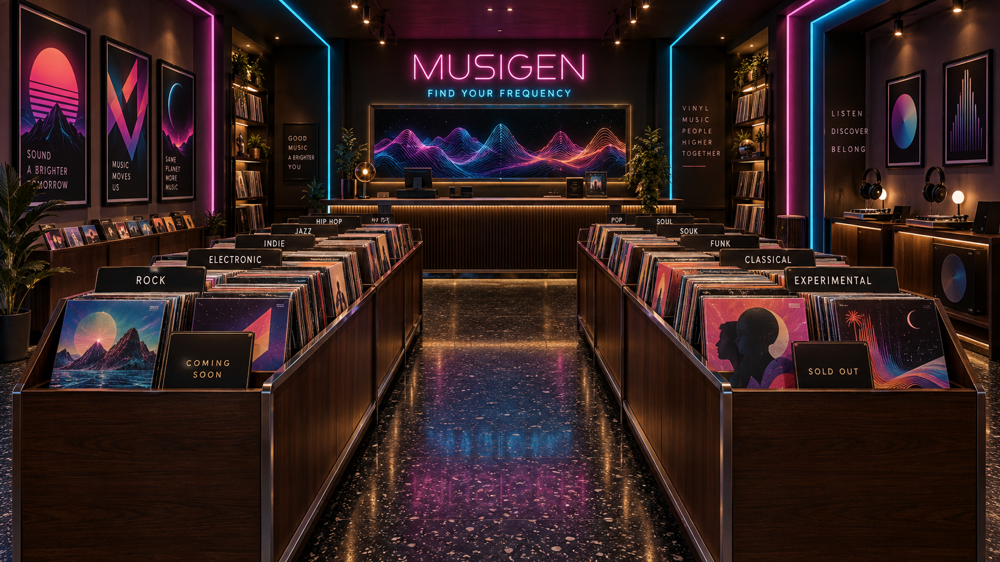
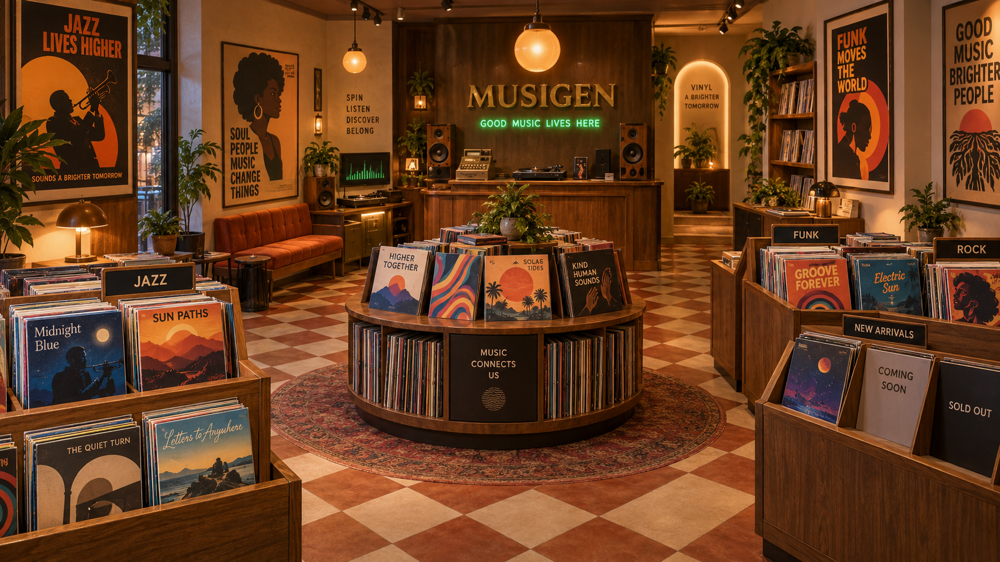
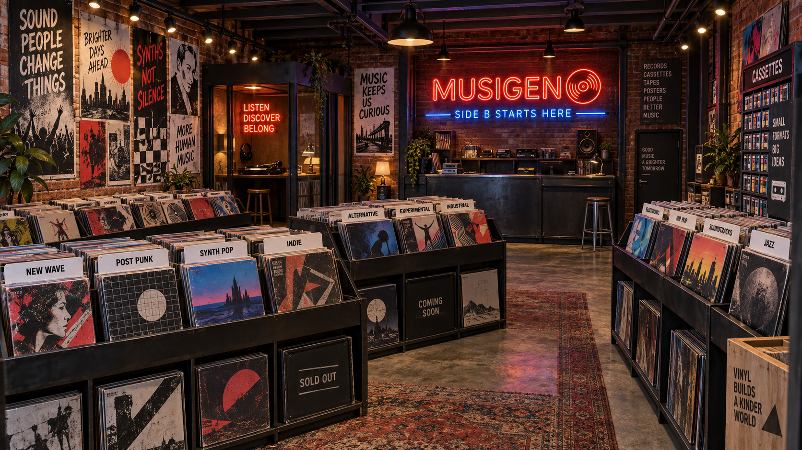
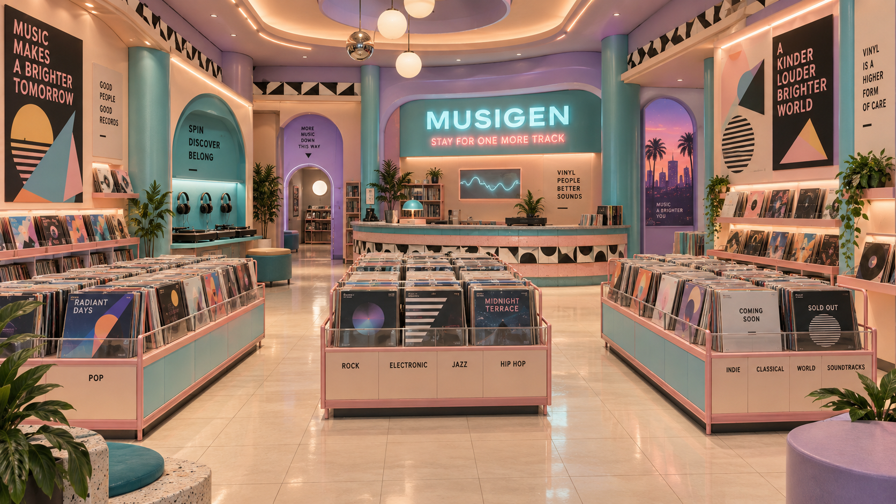

# Vinyl store concepts

Generated with the built-in image_gen tool. Concept references only; no 3D implementation yet.

Branch: codex/vinyl-store-3d. Base checkpoint: 5afec00 on codex/studio-improvements.

## Shared prompt

Generate ONE wide landscape 16:9 concept art image for a first-person interactive 3D vinyl record shop inside the MusiGen music app. Eye-level camera 1.65m from entrance looking into one buildable room; 28mm architectural perspective, straight verticals, no fisheye. High quality art-directed real-time 3D game environment render, beautiful materials, practical low-complexity architecture, grounded realistic proportions. No people, no clerk, no hands, no UI, no watermarks, no real commercial album art. This is a visual design reference, not a screenshot of implemented software.

## 01-neon-boutique

NEON BOUTIQUE. A polished 1987 premium vinyl store at night, dark walnut record bins, black terrazzo floor, chrome edges, restrained cyan and magenta neon architectural strips, warm amber spotlights on records, neon sign MUSIGEN behind an unstaffed rear sales counter, smaller neon phrase FIND YOUR FREQUENCY. Two tidy aisles of waist-height flip-through record bins, vivid original fictional album covers, genre divider cards, one clearly empty bay with COMING SOON placard, another SOLD OUT placard. Left wall original geometric synthwave posters, right wall two turntable headphone listening stations, large framed colorful abstract music visualization screen behind counter. Inviting, luxurious, readable lighting, not a nightclub. Strong symmetrical central aisle, believable human scale.

## 02-warm-hi-fi

WARM HI-FI SANCTUARY. Distinct 1982 audiophile vinyl shop, honey oak and walnut cabinetry, burnt orange upholstered listening bench, warm cream plaster, amber globe pendant lights and subtle emerald neon, terracotta and cream checkerboard floor. Asymmetric cozy room with three short browsable vinyl-bin aisles, generous walking space, round feature display of sleeves, wall-mounted original jazz/soul/funk illustrated posters. Unstaffed rear counter with vintage cash register, turntable and wood speakers; MUSIGEN brass lettering behind counter, small green neon GOOD MUSIC LIVES HERE. Original fictional colorful record sleeves face the viewer, genre dividers, empty rack bay with COMING SOON and another SOLD OUT. Warm and tactile with a small abstract music visualization screen, realistic cozy retail room, not a bar.

## 03-industrial-new-wave

INDUSTRIAL NEW WAVE. A stylish independent downtown vinyl store in 1985, converted modest brick storefront, exposed brick and dark steel shelving, concrete floor, overhead exposed beams, red-orange and electric blue neon, warm track lights that clearly illuminate album art. Diagonal record-bin islands creating navigable aisles, hand-made original punk/new-wave concert posters in dense organized wall collage, cassette wall, listening booth with turntable. Empty unstaffed black steel sales counter at back with MUSIGEN neon and neon phrase SIDE B STARTS HERE. Original fictional sleeve art, white genre tabs, one empty bay labeled COMING SOON, one SOLD OUT. Distinct edgy analog culture, artistically composed but maintain welcoming visibility, no dystopia, no nightclub, believable small one-room game environment.

## 04-pastel-mall

PASTEL MALL FUTURE. A fancy 1988 mall vinyl record shop with playful Memphis design: cream tile floor, peach and teal laminated cabinetry, lilac architectural curves, geometric black-and-white trim, turquoise neon and warm peach indirect ceiling light. Sweeping rounded unstaffed sales counter at rear, luminous MUSIGEN sign and small neon STAY FOR ONE MORE TRACK. Three low record rack islands with pink metal frames and clear browsable rows, generous flowing aisles, huge original geometric music posters and album displays, teal headphone turntable station, small abstract music visualization screen. Original fictional vinyl sleeves, genre labels, one empty rack section with COMING SOON, one SOLD OUT. Sophisticated nostalgic retail design, not toy-like, bright and easy to navigate, human scale.

